# Table of contents

- [**1. Introduction**](#1-introduction)
  - [1.1 Purpose](#11-purpose)
  - [1.2 Audience](#12-audience)
  - [1.3 Taskify Overview](#13-taskify-overview)
  - [1.4 How to use this guide](#14-how-to-use-this-guide)
- [**2. Setting up, getting started**](#2-setting-up-getting-started)
- [**3. Design**](#3-design)
  - [3.1 Architecture](#31-architecture)
  - [3.2 UI component](#32-ui-component)
  - [3.3 Logic component](#33-logic-component)
  - [3.4 Model component](#34-model-component)
  - [3.5 Storage component](#35-storage-component)
  - [3.6 Common classes](#36-common-classes)
- [**4. Implementation**](#4-implementation)
  - [4.1 Add Command](#41-add-command)
  - [4.2 Edit Command](#42-edit-command)
  - [4.3 View Command](#43-view-command)
  - [4.4 Switch between the different tabs](#44-switch-between-the-different-tabs)
  - [4.5 Tag Search Command](#45-tag-search-command)
  - [4.6 Delete multiple tasks with indices](#46-delete-multiple-tasks-with-indices)
  - [4.7 Delete multiple tasks with an index range](#47-delete-multiple-tasks-with-an-index-range)
  - [4.8 Delete all tasks of a specified status](#48-delete-all-tasks-of-a-specified-status)
- [**5. Documentation, logging, testing, configuration, dev-ops**](#5-documentation-logging-testing-configuration-dev-ops)
- [**6. Appendix: Requirements**](#6-appendix-requirements)
  - [6.1 Product scope](#61-product-scope)
  - [6.2 User stories](#62-user-stories)
  - [6.3 Use cases](#63-use-cases)
  - [6.4 Non-Functional Requirements](#64-non-functional-requirements)
  - [6.5 Glossary](#65-glossary)
- [**7. Appendix: Instructions for manual testing**](#7-appendix-instructions-for-manual-testing)
  - [7.1 Launch and shutdown](#71-launch-and-shutdown)
  - [7.2 Adding a task](#72-adding-a-task)
  - [7.3 Editing a task](#73-editing-a-task)
  - [7.4 Deleting a task](#74-deleting-a-task)
  - [7.5 Switching Tabs](#75-switching-tabs)
  - [7.6 Sorting Tasks](#76-sorting-tasks)
  - [7.7 Viewing help](#77-viewing-help)
  - [7.8 Clearing Data](#78-clearing-data)
- [**8. Appendix: Effort**](#8-appendix-effort)  

--------------------------------------------------------------------------------------------------------------------
# **1. Introduction**

## 1.1 Purpose

The purpose of this Developer Guide is to describe the design, implementation and documentation of Taskify. This 
document intends for the reader to understand the relationship between the components that make up Taskify.

## 1.2 Audience

This Developer Guide is for anyone who wishes to understand the internal software architecture of Taskify.
In addition, the following groups are the intended target of this documentation:

* CS2103T / CS2101 Teaching Team - as a means to evaluate the design, implementation and documentation of Taskify.
* Potential Taskify Developers - as a means to understand the internal structure of Taskify to potentially expand
upon Taskify in the future.
  
## 1.3 Taskify Overview
Taskify is a desktop app intended for university students, optimized for fast typists via a Command Line Interface 
(CLI). Taskify helps users keep track of their tasks with a clean and simplistic interface.

## 1.4 How to use this guide
This Developer Guide is structured in a top-down manner, starting with the overall architecture of Taskify, followed
by in-depth descriptions and implementations.

For your convenience, use the **Table of Contents** above to navigate to a section quickly.

--------------------------------------------------------------------------------------------------------------------

# **2. Setting up, getting started**

Refer to the guide [_Setting up and getting started_](SettingUp.md).

--------------------------------------------------------------------------------------------------------------------

# **3. Design**

## 3.1 Architecture

The ***Architecture Diagram*** given above explains the high-level of design Taskify. Given below is a quick overview
of each component.

:bulb: **Tip:** The `.puml` files used to create diagrams in this document can be found in
the [diagrams](https://github.com/AY2021S2-CS2103T-W14-4/tp/tree/master/docs/diagrams) folder. Refer to the [_PlantUML
Tutorial_ at se-edu/guides](https://se-education.org/guides/tutorials/plantUml.html) to learn how to create and edit
diagrams.

**`Main`** has two classes
called [`Main`](https://github.com/AY2021S2-CS2103T-W14-4/tp/blob/master/src/main/java/seedu/taskify/Main.java)
and [`MainApp`](https://github.com/AY2021S2-CS2103T-W14-4/tp/blob/master/src/main/java/seedu/taskify/MainApp.java). It
is responsible for,

* At app launch: Initializes the components in the correct sequence, and connects them up with each other.
* At shut down: Shuts down the components and invokes cleanup methods where necessary.

[**`Commons`**](https://github.com/AY2021S2-CS2103T-W14-4/tp/tree/master/src/main/java/seedu/taskify/commons) represents a collection of classes used by multiple other components.

The rest of the App consists of four components.

* [**`UI`**](https://github.com/AY2021S2-CS2103T-W14-4/tp/tree/master/src/main/java/seedu/taskify/ui): The UI of Taskify.
* [**`Logic`**](https://github.com/AY2021S2-CS2103T-W14-4/tp/tree/master/src/main/java/seedu/taskify/logic): The command executor.
* [**`Model`**](https://github.com/AY2021S2-CS2103T-W14-4/tp/tree/master/src/main/java/seedu/taskify/model): Holds the data of Taskify in memory.
* [**`Storage`**](https://github.com/AY2021S2-CS2103T-W14-4/tp/tree/master/src/main/java/seedu/taskify/storage): Reads data from, and writes data to, the hard disk.

Each of the four components,

* defines its *API* in an `interface` with the same name as the Component.
* exposes its functionality using a concrete `{Component Name}Manager` class (which implements the corresponding
  API `interface`) mentioned in the previous point.

For example, the `Logic` component (see the class diagram given below) defines its API in the `Logic.java` interface
and exposes its functionality using the `LogicManager.java` class which implements the `Logic` interface.

**How the architecture components interact with each other**

The *Sequence Diagram* below shows how the components interact with each other for the scenario where the user issues
the command `delete 1`.

The sections below give more details of each component.

## 3.2 UI component

**API** :
[`Ui.java`](https://github.com/AY2021S2-CS2103T-W14-4/tp/blob/master/src/main/java/seedu/taskify/ui/Ui.java)

The UI consists of a `MainWindow` that is made up of parts e.g.`CommandBox`, `ResultDisplay`, `TaskListPanel`
, `StatusBarFooter` etc. All these, including the `MainWindow`, inherit from the abstract `UiPart` class.

The `UI` component uses JavaFx UI framework. The layout of these UI parts are defined in matching `.fxml` files that
are in the `src/main/resources/view` folder. For example, the layout of
the [`MainWindow`](https://github.com/AY2021S2-CS2103T-W14-4/tp/blob/master/src/main/java/seedu/taskify/ui/MainWindow.java)
is specified
in [`MainWindow.fxml`](https://github.com/AY2021S2-CS2103T-W14-4/tp/blob/master/src/main/resources/view/MainWindow.fxml)

The `UI` component,

* Executes user commands using the `Logic` component.
* Listens for changes to `Model` data so that the UI can be updated with the modified data.

## 3.3 Logic component

**API** :
[`Logic.java`](https://github.com/AY2021S2-CS2103T-W14-4/tp/blob/master/src/main/java/seedu/taskify/logic/Logic.java)

1. `Logic` uses the `TaskifyParser` class to parse the user command.
1. This results in a `Command` object which is executed by the `LogicManager`.
1. The command execution can affect the `Model` (e.g. adding a task).
1. The result of the command execution is encapsulated as a `CommandResult` object which is passed back to the `Ui`.
1. In addition, the `CommandResult` object can also instruct the `Ui` to perform certain actions, such as displaying
   help to the user.

Given below is the Sequence Diagram for interactions within the `Logic` component for the `execute("delete 1")` API
call.

:information_source: **Note:** The lifeline for `DeleteCommandParser` should end at the destroy marker (X) but due to a limitation of PlantUML, the lifeline reaches the end of diagram.

## 3.4 Model component

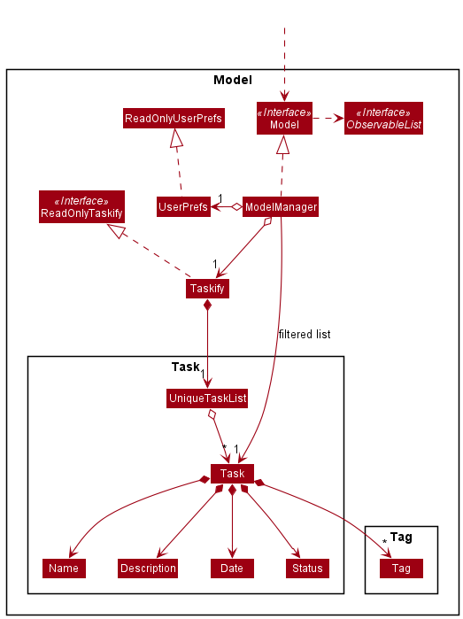

**API** : [`Model.java`](https://github.com/AY2021S2-CS2103T-W14-4/tp/blob/master/src/main/java/seedu/taskify/model/Model.java)

The `Model`,

* stores a `UserPref` object that represents the user’s preferences.
* stores taskify data.
* exposes an unmodifiable `ObservableList<Task>` that can be 'observed' e.g. the UI can be bound to this list so that
  the UI automatically updates when the data in the list change.
* does not depend on any of the other three components.

:information_source: **Note:** An alternative (arguably, a more OOP) model is given below. It has a `Tag` list in the `Taskify`, which `Task` references. This allows `Taskify` to only require one `Tag` object per unique `Tag`, instead of each `Task` needing their own `Tag` object. 

## 3.5 Storage component

**API** : [`Storage.java`](https://github.com/AY2021S2-CS2103T-W14-4/tp/blob/master/src/main/java/seedu/taskify/storage/Storage.java)

The `Storage` component,

* can save `UserPref` objects in json format and read it back.
* can save the Taskify data in json format and read it back.

## 3.6 Common classes

Classes used by multiple components are in the `seedu.taskify.commons` package.

--------------------------------------------------------------------------------------------------------------------
# **4. Implementation**

The previous Design section provides an overview on the general structure of Taskify. This section dives deeper and
describes some noteworthy details on how certain features are implemented.

## 4.1 Add Command

#### Implementation
The add command mainly uses the Logic and Model components. The add command takes in the following parameters:
* `n/Name`
* `desc/Description`
* `date/Date`
* `t/Tags`

The following activity diagram summarizes what happens when a user executes an add command.
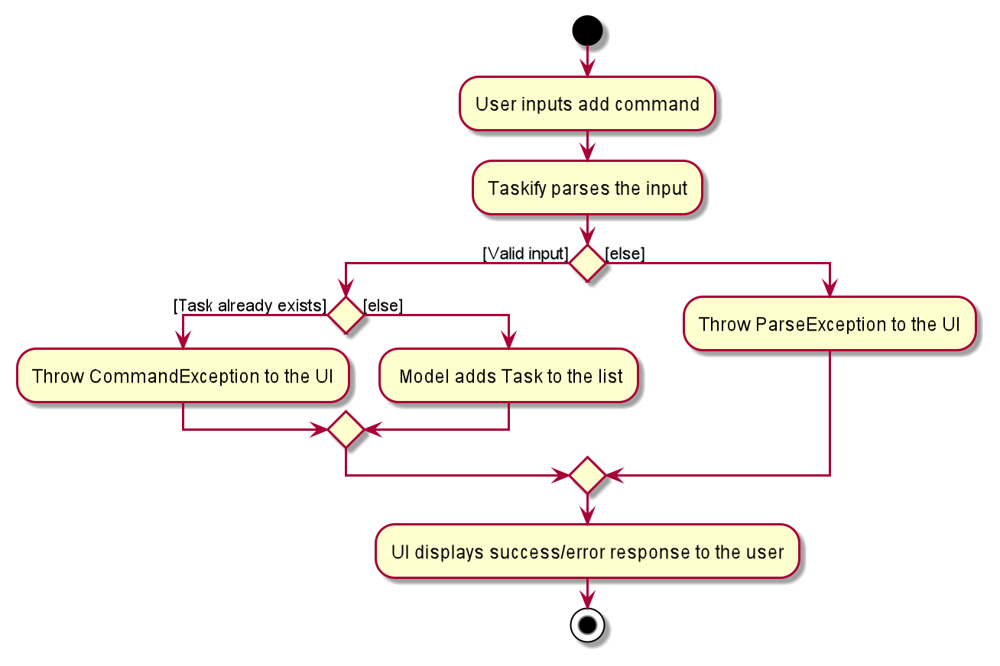

The following sequence diagram shows the execution of the add command.
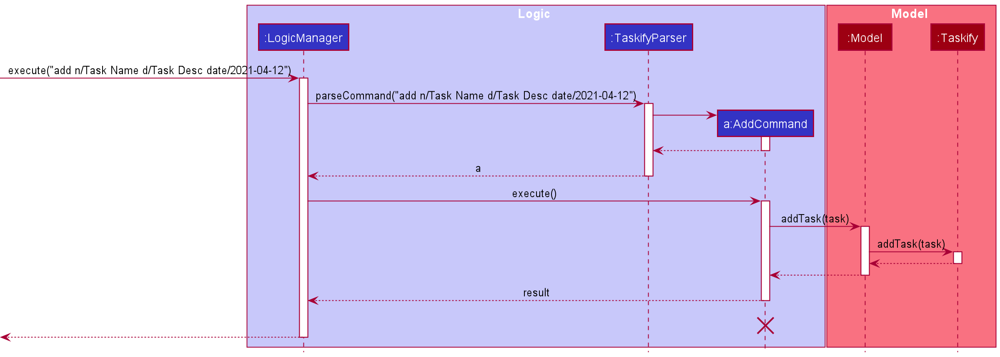

## 4.2 Edit Command

#### Implementation
The edit command has a similar implementation to the add command, it mainly uses the Logic and Model components 
(see Diagrams in 4.1). The only notable differences are:
* The edit command is able to take in an extra parameter `s/Status`.
* Edit command takes in an `index` to specify which Task in the list to edit.

The following activity diagram summarizes what happens when a user executes an edit command.
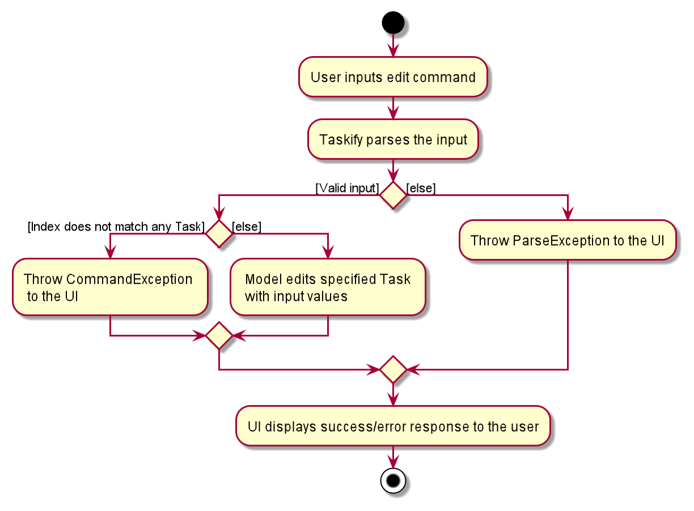

The following sequence diagram shows the execution of the edit command.

## 4.3 View Command
The `view` command allows users to view `Tasks` that have the same `Date` as the input `Date`.

#### Implementation
This command essentially creates a `TaskHasSameDatePredicate`. This predicate is used on `ObservableList<Task>`
in `Model` which filters the list by searching for `Tasks` that matches the given input `Date`.

The following sequence diagram shows how the `view` command works. We will assume the user inputs
`view 2021-04-12`, that is, the user intends to view all tasks that have the date 12th April 2021.

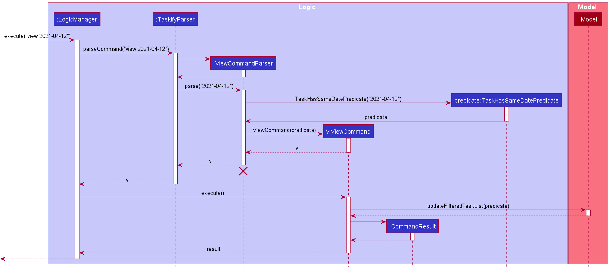
1. The user inputs `view 2021-04-12`.
2. TaskifyParser identifies this as a `view` command and creates a `ViewCommandParser` and call its parse method
with the arguments specified by the user (in this case, `2021-04-12`).
3. `ViewCommandParser` creates a new `TaskHasSameDatePredicate` with the arguments `2021-04-12`.
4. `ViewCommandParser` creates a new `ViewCommand` with the newly created `TaskHasSameDatePredicate` object.
5. When `ViewCommand`'s execute method is called, it prompts `Model` to call `updateFilteredTaskList()` with the 
`TaskHasSameDatePredicate` predicate.
6. `Model` updates the filtered list based on the predicate.
7. The result of this command is returned, and the success message String from `CommandResult` is displayed 
to the user.

The following activity diagram summarizes what happens when a user executes a view command:
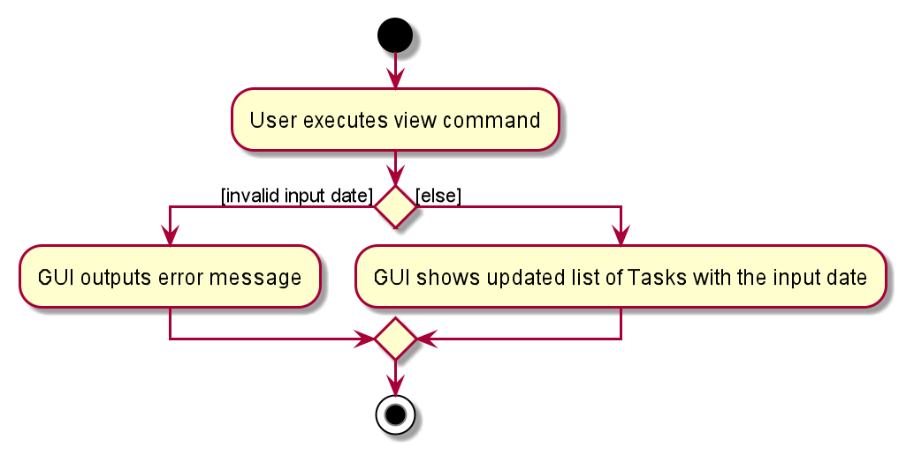
   
#### Design Consideration
* **Problem**: Typing out the entire date might be too cumbersome or unintuitive.
* **Solution**: Use intuitive keywords such as `today` or `tomorrow` to represent dates. As such, users can
input commands like `view today` or `view tomorrow` as a shortcut, instead of typing out
  the entire date.

## 4.4 Switch between the different tabs

### Format of command
* `home`: switch from the other tab to home tab. It will throw an error if you are already in the home tab.
* `expired`: switch from the other tab to expired tab. It will throw an error if you are already in the expired tab.
* `uncompleted`: switch from the other tab to uncompleted tab. It will throw an error if you are already in the uncompleted tab.
* `completed`: switch from the other tab to uncompleted tab. It will throw an error if you are already in the completed tab.

### Implementation

The tab switching functionality is facilitated by the `MainWindow#switchTab(int tabNumber)` depending on which tab you
want to switch to and what tab users are currently on now.

The model manager has 5 filtered task list. They are `filteredTasks`, `expiredFilteredTasks`,
`uncompletedFilteredTasks`, `completedFilteredTasks` and `todaysFilteredTasks`. The first 4 filtered task list is used for tab
switching. All the filtered task list originated from UniqueTaskList.

The following sequence diagram shows how the switching tabs operation works, we will take the Expired Command as
an example to illustrate as the other tab switching commands is similar.

The following activity diagram summarizes what happens when a user executes a switch command like `expired`:

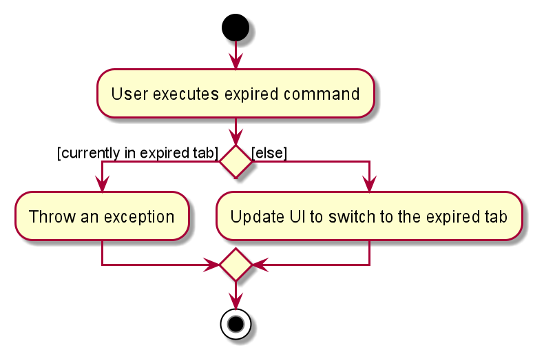

### Design Consideration
* **Current Choice:** Switch tabs based on the tab name.
    * Pros: More intuitive to the user. The tab name corresponds to the status of the tasks for that tab.
    * Cons: User would have to type longer sentence as compared to `switch 1`

* **Alternative Choice:** Switch tabs based on tab index
    * Pros: Lesser things to remember as the format command is `switch index`
    * Cons: Less intuitive as user will have to look up what tab one corresponds to.

## 4.5 Tag Search Command

### Implementation

The implementation of the Tag Search feature is facilitated by `TagContainsKeywordsPredicate` which implements
`Predicate<Task>` and has the `test` method's implementation overridden to test if a `Task` has tags that match any
of the tags entered by the user.

The `TagContainsKeywordsPredicate#test(Task)` iterates through the `keywords` of type `List<String>` and
checks if any of the `keywords` match the tags in the `Task`. If one or more of the tags match the function returns true.

`Task` has the following function to retrieve the tags:
* `Task#getTags()` - Return the tags of a `Task` .

`TagContainsKeywordsPredicate` will be passed to `Model#updateXYZFilteredTaskList(Predicate)`
(`updateFilteredTaskList`, `updateUncompleredFilteredTaskList`, etc.) depending on which tab is currently active. The
filtered list will then be updated according to the given `Predicate` and the changes will be reflected on the UI.

The following sequence diagram shows how the tag-search command works. As an example we will take `tag-search
tutorial cs2100` as input.

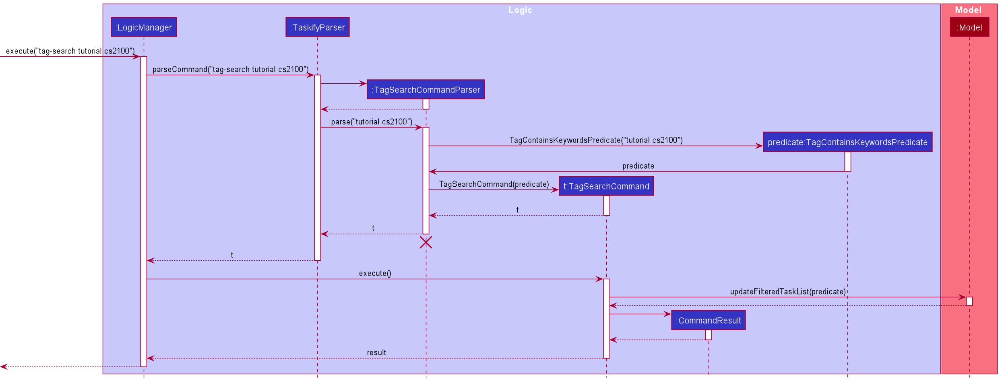

The following activity diagram summarizes what happens when a user executes the tag-search command:

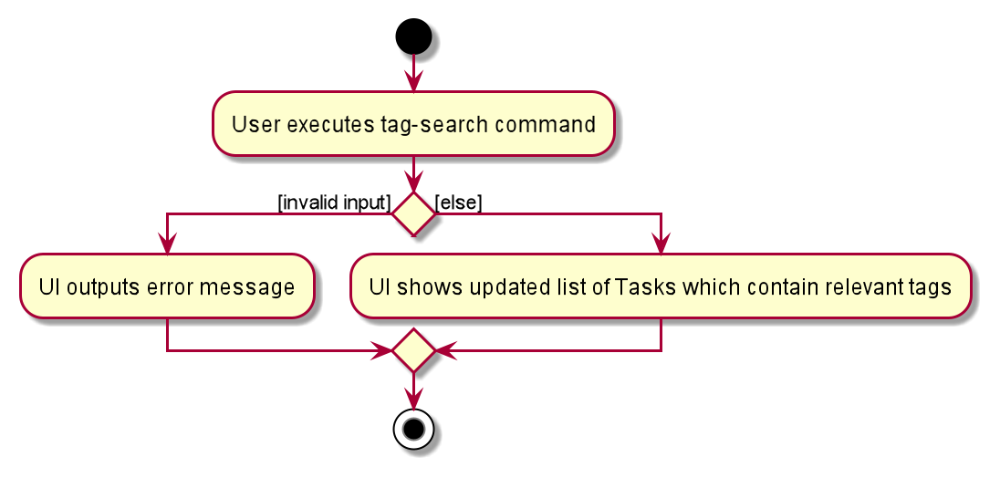

### Design Consideration
* **Current Choice:** Search for tasks bases on one or more tags.
    * Pros: Simple and intuitive for user to filter out similar tasks by using tags.
    * Cons: User would have to type out all the tags individually if there are multiple tasks with unique tags

* **Alternative Choice:** Search for tasks using a collection of tags grouped together with the same label.
    * Pros: Users can type less and save time if they have multiple tags to search for.
    * Cons: Less intuitive as user will have to keep track of which tags are under which group.

## 4.6 Delete multiple tasks with indices
This feature allows users to list out the [indices](#65-glossary) of tasks to delete.

### Implementation
This feature is facilitated by `DeleteMultipleCommand`, which is a `Command` that is executed with `execute()`. It relies on `DeleteUtil#hasMultipleValidIndex` as a validity check,
which is done in `TaskifyParser`. If valid, `DeleteMultipleCommandParser#parse` is called, and returns a `DeleteMultipleCommand`.

The following class diagram shows the relationship between classes for a successful execution.

The following sequence diagram traces the step-by-step execution of deleting multiple tasks with multiple indices.

### Design Consideration

#### Aspect 1: Problem & Solution
* **Problem**: Deleting several tasks with the default delete feature is too cumbersome
* **Solution**: Allow listing of multiple indices after typing `delete` once.

#### Aspect 2: Design of solution
* **Solution 1 (selected)**: Create a new command that is not a subclass of `DeleteCommand`
    * Pros: Decouple the new command from `DeleteCommand` and obey SRP.
    * Cons: Harder to implement

* **Solution 2**: Make the new command a subclass of `DeleteCommand` or include a list of `DeleteCommand` as a field in the new command
    * Pros: Intuitive and easy to understand, easy to implement either solution
    * Cons: Violates SRP

Solution 1 was selected for its better benefits as well as increased testability.

## 4.7 Delete multiple tasks with an index range
This feature allows users to provide an index range to delete all tasks within the range, inclusive of the upper and lower bound indices.

### Implementation
This feature is also facilitated by `DeleteMultipleCommand`. The execution of this `DeleteMultipleCommand` is extremely similar to that in the
[deleting multiple tasks with **multiple indices** feature](#44-delete-multiple-tasks-with-indices), with the only difference in
the `isDeletingByRange` field in both `DeleteMultipleCommand` objects. This field is used for handling exceptions appropriately in
`DeleteUtil#getTasksToDelete(List<Task>, List<Index>, boolean)`. This field is determined by `DeleteMultipleCommand#parse`, which checks
if the user is deleting tasks using indices or an index range by consulting `DeleteUtil#isDeletingTasksByRange`.

The responsible class diagram for this feature is [here](#classdiag), which is also the same as that in the "delete multiple tasks with indices" feature.

The following sequence diagram traces the step-by-step execution of deleting multiple tasks with an index range.

### Design Consideration

#### Aspect 1: Problem & Solution
* **Problem**: Listing indices individually after typing `delete` to delete many tasks might be cumbersome as well
* **Solution**: Allow users to delete tasks using a range.

#### Aspect 2: Design of solution
`DeleteMultipleCommand` was already implemented to store the indices of the tasks to delete. A simple solution was to parse the index range
its individual indices, and create a `DeleteMultipleCommand` with those indices. Testability might have reduced a little by adding some
additional exceptions to be thrown within the execution of the command, but deleting either by an index range or individual indices seems to
be part of the same responsibility, so it likely does not violate SRP.

## 4.8 Delete all tasks of a specified status
This feature allows users to provide a `Status` to delete all tasks that are of that `Status`.

### Implementation
This feature is facilitated by the `DeleteByStatusCommand`. It does a validity check by calling `DeleteUtil#isDeletingTasksByStatus` in `TaskifyParser`,
and `DeleteByStatusCommandParser#parse` calls `ParserUtil#parseInputToStatus` to parse the user's input arguments into the desired `Status`, which
is stored as a field in `DeleteByStatusCommand` for use in the execution of the command (i.e `DeleteByStatusCommand#execute`).

The following class diagram shows the relationship between classes for a successful execution. The only difference between this diagram and the class
diagram for the previous two delete multiple tasks features is the name of the `Command` and the command's `Parser`.
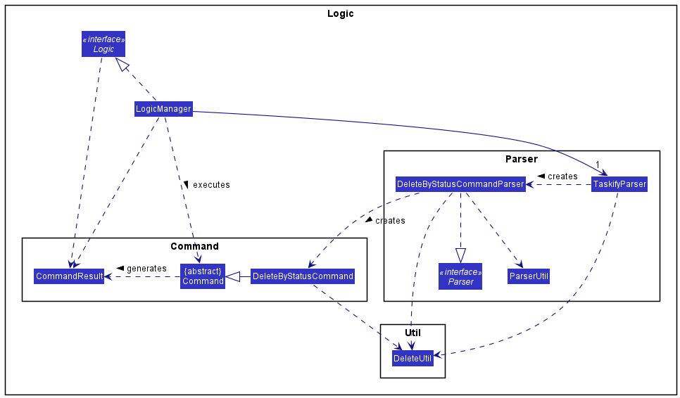

The following sequence diagram traces the step-by-step execution of deleting all tasks of a specified status.
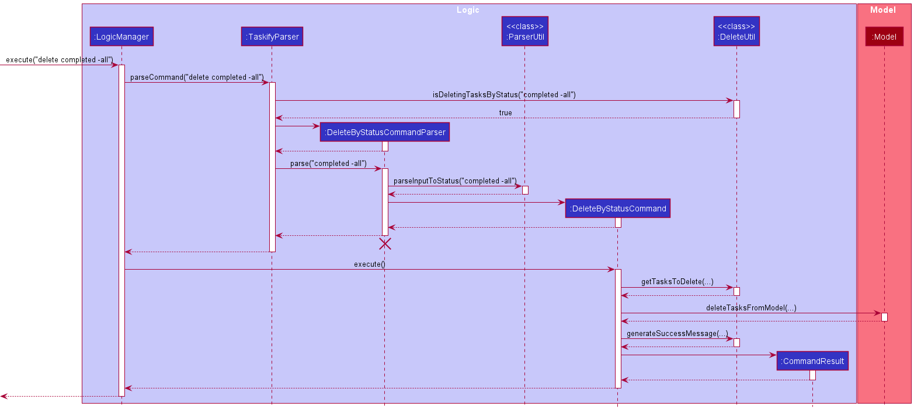

### Design Consideration

#### Aspect 1: Problem & Solution
* **Problem**: Instead of deleting by indices, users might want to delete all tasks of a specific `Status`, which might be cumbersome with the existing two features for deleting multiple tasks. 
  i.e The user might want to clear all `completed` or `expired` tasks quickly, but that would require the user to check all indices of the tasks with the desired `Status`.
* **Solution**: Allow deletion of tasks by their `Status`.

#### Aspect 2: Design of solution
* **Solution 1 (originally)** : Integrate new logic into existing logic in `DeleteMultipleCommand`, since multiple tasks are to be deleted anyway.
    * Pros : Less code
    * Cons : Decreases cohesion in `DeleteMultipleCommand`, makes code less readable, violate SRP.
* **Solution 2 (selected)** : Refactor the new logic (in Solution 1) into a new command
    * Pros : Obeys SRP, cohesive code in `DeleteMultipleCommand` and the new command. Increases readibility and testability.
    * Cons : More test and main code

Solution 2 was selected since the amount of code to write shouldn't be a huge factor in deciding which solution is better. The other factors explained
are much more important.

--------------------------------------------------------------------------------------------------------------------

# **5. Documentation, logging, testing, configuration, dev-ops**

* [Documentation guide](Documentation.md)
* [Testing guide](Testing.md)
* [Logging guide](Logging.md)
* [Configuration guide](Configuration.md)
* [DevOps guide](DevOps.md)

--------------------------------------------------------------------------------------------------------------------

# **6. Appendix: Requirements**

## 6.1 Product scope

**Target user profile**:

* prefer desktop apps over other types
* can type fast
* is reasonably comfortable using CLI apps

**Value proposition**: help students manage their tasks in a systematic and efficient manner

## 6.2 User stories

Priorities: High (must have) - `* * *`, Medium (nice to have) - `* *`, Low (unlikely to have) - `*`

| Priority | As a …​                                    | I want to …​                   | So that I can…​                                             |
| -------- | ------------------------------------------ | ------------------------------ | ---------------------------------------------------------------------- |
| `* * *`  | university student                         | add tasks                      | track a task that I have to do                                         |
| `* * *`  | university student                         | check off tasks                | view which tasks have been completed                                   |
| `* * *`  | university student                         | edit task details              | update any changes to the tasks                                        |
| `* * *`    | organized university student             | list all my tasks in a structured manner   | feel more in control of my schedules and tasks             |
| `* * *`  | university student                         | delete tasks                   | declutter the list of tasks                                            |
| `* * *`  | university student                         | view deadlines of tasks        | finish tasks that are more urgent                                      |
| `* * *`  | busy university student                    | tag the task based on category | organise my tasks efficiently                                          |
| `* * *`  | university student                         | set status of a task           | get an overview of my progress                         |
| `* * *`  | university student                         | view a list of completed and uncompleted tasks           | have a better understanding of my progress so far|
| `* * *`    | busy university student                    | view tasks based on category tags         | locate tasks easily                                     |
| `* *`    | busy university student                    | search for tasks based on date         | easily plan my schedule                                   |
| `* *`    | busy university student                    | delete multiple tasks at once        | clean up the task in the app easily                                   |
| `* *`    | organized university student               | view all tasks in chronological order (of date) | plan my day/week efficiently                             |

## 6.3 Use cases

(For all use cases below, the **System** is the `Taskify` and the **Actor** is the `user`, unless specified otherwise)

---
**Use case 1: Delete a Task**

**MSS**

1. User requests to list all Tasks
2. Taskify shows a list of Tasks
3. User requests to delete a specific Task in the list
4. Taskify deletes the Task

   Use case ends.

**Extensions**

* 2a. The list is empty.
    * 2a1. Taskify warns that the list is empty.
      
      Use case ends.

* 3a. The given index is invalid.
    * 3a1. Taskify warns that the index entered is invalid.
      
      Use case ends.

---
**Use case 2: Add a Task**

**MSS**

1. User requests to add a Task to the list
2. Taskify adds the Task to the list

   Use case ends.

**Extensions**

* 1a. The Task to be added already exists in the list
    * 1a1. Taskify warns the User that there is already such a Task
      
      Use case ends.

* 1b. The User fails to fill in any of the compulsory fields to create a new Task
    * 1b1. Taskify informs the User of the format of creating a new Task 
      
      Use case ends.
  
* 1c. The User's input is unrecognisable to Taskify
    * 1c1. Taskify informs the User of the format of creating a new Task 
      
      Use case ends.
    
---
**Use case 3: Set status of Task**

**MSS**

1. User requests to set the status of the Task 
2. Taskify changes the status of the Task

   Use case ends.

**Extensions**

* 1a. The current status of the Task is the same as status the User requests to set for the same Task
    * 1a1. Taskify warns that the Task is already of the set status 
      
      Use case ends.

* 1b. The given status is expired. Even though `expired` is a valid status of a task, users cannot directly modify it.
    * 1b1. Taskify warns that it can change the status of the task if it is either `uncompleted` or `completed` . 
    
      Use case ends.
  
* 1c. Taskify does not recognise the status that the User wants to set
    * 1c1. Taskify warns that it does not understand the type of status entered
    
      Use case ends.
    
* 1d. The given index is invalid
    * 1d1. Taskify warns that the index entered is invalid.
    
      Use case ends.    

---
**Use case 4: List all Tasks**

**MSS**

1. User requests to list all Tasks
2. Taskify lists all the Tasks 
   
   Use case ends.

**Extensions**

* 1a. There are no tasks stored
    * 1a1. Taskify informs the User there are no tasks tracked
    
      Use case ends.
---
**Use case 5: Search for Tasks by Tags**

**MSS**

1. User requests to find Task(s) by tags based on a list of tags.
2. Taskify shows the Tasks that match one or more of the given tags.    
   
    Use case ends.

**Extensions**
* 1a. Taskify cannot find any Task with the given tags
    * 1a1. Taskify informs the User that no Tasks are found.
      
      Use case ends.
    
* 1b. The User's input is unrecognisable to Taskify
    * 1b1. Taskify informs the User on the format of command to search for tasks by tags.
    
      Use case ends.

---
**Use case 6: Sort all Tasks (in ascending order of their date & time)**

**MSS**

1. User requests to sort the Tasks.
2. Taskify shows the Tasks in their sorted order.   
   
    Use case ends.

---
**Use case 7: Search for Tasks by Name**

**MSS**

1. User requests to find Task(s) by name based on a list of keywords.
2. Taskify shows the Tasks that match the given keywords.    
   
    Use case ends.

**Extensions**
* 1a. Taskify cannot find any Task with the given keywords
    * 1a1. Taskify informs the User that no Tasks are found.
    
      Use case ends.
    
* 1b. The User's input is unrecognisable to Taskify
    * 1b1. Taskify informs the User on the format of command to search for tasks by name.
    
      Use case ends.
---
**Use case 8: Modifying an existing Task**

**MSS**

1. User requests to modify an existing Task
2. Taskify shows the User the modified Task.     
   
   Use case ends.

**Extensions**
* 1a. The User's input is unrecognisable to Taskify
    * 1a1. Taskify informs the User on the format to edit a Task.
    
      Use case ends.
    
* 1b. The User's input for specific fields is invalid
    * 1b1. Taskify informs the User on the correct format of the field in the User's input that failed to pass validation checks.
    
      Use case ends.
    
* 1c. The User's input does not include any fields at all.
    * 1c1. Taskify warns that no modifying can take place if there are no updated fields filled in.
    
      Use case ends.
    
---

**Use case 9: Switch to Home tab**

**MSS**

1. User requests to switch to Home Tab.
2. Taskify switches to Home Tab.   
   
    Use case ends.

**Extensions**
* 1a. If the user is currently in the Home tab 
    * 1a1. Taskify informs the User that it is currently in the Home tab.
    
      Use case ends.

* 1b. The User's input is unrecognisable to Taskify
    * 1b1. An error message is shown.
    
      Use case ends.
      
---

**Use case 10: Switch to Expired tab**

**MSS**

1. User requests to switch to Expired Tab.
2. Taskify switches to Expired Tab.

   Use Case ends.

**Extensions**
* 1a. If the user is currently in the Expired Tab
    * 1a1. Taskify informs the User that it is currently in the Expired Tab.
    
      Use case ends.
    
* 1b. The User's input is unrecognisable to Taskify
    * 1b1. An error message is shown.
    
      Use case ends.

---

**Use case 11: Switch to Completed tab**

**MSS**

1. User requests to switch to Completed Tab.
2. Taskify switches to Completed Tab.

   Use Case ends.

**Extensions**
* 1a. If the user is currently in the Completed Tab
    * 1a1. Taskify informs the User that it is currently in the Completed Tab.
    
      Use case ends.

* 1b. The User's input is unrecognisable to Taskify
    * 1b1. An error message is shown.
    
      Use case ends.

---
    

**Use case 12: Switch to Uncompleted tab**

**MSS**

1. User requests to switch to Uncompleted Tab.
2. Taskify switches to Uncompleted Tab.

   Use Case ends.

**Extensions**
* 1a. If the user is currently in the Uncompleted Tab
    * 1a1. Taskify informs the User that it is currently in the Uncompleted Tab.
    
      Use case ends.

* 1b. The User's input is unrecognisable to Taskify
    * 1b1. An error message is shown.
    
      Use case ends.
    
---

**Use case 13: Viewing Tasks by date**

**MSS**

1. User requests to view all Tasks that are due on specified date.
2. Taskify shows the User Tasks with the same date.   

   Use case ends.

**Extensions**
* 1a. There are no tasks stored
    * 1a1. Taskify informs the User there are no tasks tracked   
      
      Use case ends.
      
---

## 6.4 Non-Functional Requirements

1. Should work on any _mainstream OS_ as long as it has Java `11` or above installed.
2. Should be able to hold up to 100 tasks without a noticeable sluggishness in performance for typical usage.
3. A user should be able to easily see why their commands are invalid
4. The app should be able to save data locally
5. The app should be able to run with or without internet connection
6. The product should not take above 5 seconds to execute any commands.

## 6.5 Glossary
* **SRP**: Single Responsibility Principle
* **Mainstream OS**: Windows, Linux, Unix, OS-X
* **Indices**: Plural form of **Index**

--------------------------------------------------------------------------------------------------------------------

# **7. Appendix: Instructions for manual testing**

Given below are instructions to test the app manually.

:information_source: **Note:** These instructions only provide a starting point for testers to work on;
testers are expected to do more *exploratory* testing.

## 7.1 Launch and shutdown

1. Initial launch

    1. Download the jar file and copy into an empty folder

    1. Double-click the jar file 
       Expected: Shows the GUI with a set of sample contacts. The window size may not be
       optimum.

1. Saving window preferences

    1. Resize the window to an optimum size. Move the window to a different location. Close the window.

    1. Re-launch the app by double-clicking the jar file. 
       Expected: The most recent window size and location is retained.

1. Shutting down

    1. Launch the help window `help` command.

    1. Close the app using the `exit` command.  
       Expected: Both the main window, and the help window should close.

## 7.2 Adding a task

1. Adding a task on the home tab.

    1. Prerequisites: User should be on the home tab and there should not be any task with the same name in the list.
       If there is such a task, delete it.

    1. Test case: `add n/Finish 2103T Tutorial desc/Draw UML diagram date/2021-04-13 10:30 t/CS2103T` 
       Expected: Task named Finish 2103T Tutorial should appear in the list of tasks on the home tab. It should 
       appear at the bottom of the list ,and the details should be as entered.

    1. Test case: `add n/Old Task desc/Draw UML diagram date/2015-04-13 10:30 t/CS2103T` 
       Expected: No task is added. Error details indicating that the date should not be in the past shown in 
       status 
       message.
       
1. Adding a task on a non-home tab.

    1. Prerequisites: User should be on any tab other than the home tab and there should not be any task with the same 
       name in the list. If there is such a task, delete it.

    1. Test case: `add n/Finish 2103T Tutorial desc/Draw UML diagram date/2021-04-13 10:30 t/CS2103T` 
       Expected: No task is added since the user has to be on the home tab to add tasks. Error message instructing 
       the user to switch to the home tab shown in status message.

## 7.3 Editing a task

1. Editing a task on the home tab.

    1. Prerequisites: User should be on the home tab. There should be at least 1 task in the task list.

    1. Test case: `edit 1 t/newtag` 
       Expected: Task with index 1 is edited such that it will have a single tag named newtag.

    1. Test case: `edit 1 s/completed desc/new description` 
       Expected: Task with index 1 will be edited, and the new details should be as entered.

    1. Test case: `edit 0 s/completed desc/new description` 
       Expected: No event is deleted. Error details shown in the status message.
       
    1. Other incorrect edit commands to try: `edit`, `edit x` (where x is larger than the list size).
       Expected: Similar to previous.

1. Editing a task on a non-home tab.

    1. Prerequisites: User should be on any tab other than the home tab and there should be at least 1 task in the 
       task list

    1. Test case: `edit 1 s/completed desc/new description` 
       Expected: No task is edited since the user has to be on the home tab to add tasks. Error message instructing
       the user to switch to the home tab shown in status message.

## 7.4 Deleting a task

1. Deleting a task on a non-home tab.

    1. Prerequisites: User should be on any tab other than the home tab. There are at least 1 task(s) to delete shown in the home tab.

    1. Test case: `delete 1` 
       Expected: No task is deleted since the user has to be on the home tab to delete tasks. Error message instructing
       the user to switch to the home tab shown in status message.

1. Deleting one task by index on a home tab.

    1. Prerequisites: User should be on the home tab. There should be at least 1 task in the task list. 
        
    1. Test case: `delete 1` 
      Expected: Task with index 1 will be deleted, and the details of the deleted task is shown
       
1. Deleting multiple tasks on a home tab

    1. Prerequisites: User should be on the home tab. There should be at least 2 tasks in the task list. 
       There should be at least 1 task with their status as `uncompleted`, and **no** tasks with the `expired` status
    
    1. Test case: `delete 1 2` 
    Expected: Tasks with indices 1 and 2 will be deleted, and the details of the deleted tasks is shown
       
    1. Test case: `delete 1-2` 
    Expected: Tasks with indices 1 and 2 will be deleted, and the details of the deleted tasks is shown
       
    1. Test case: `delete uncompleted` 
    Expected: All tasks with the `uncompleted` status are deleted. 
       
    1. Test case: `delete expired` 
    Expected: An error message **"There are no tasks with the given status!"** is given as there are no expired tasks.

## 7.5 Switching Tabs

1. Switching to home tab
    1. Test case: `home` 
       Expected: If not already on the home tab, the UI will switch to the home tab.
1. Switching to expired tab
    1. Test case: `expired` 
       Expected: If not already on the expired tab, the UI will switch to the home tab.
1. Switching to completed tab      
    1. Test case: `completed` 
       Expected: If not already on the completed tab, the UI will switch to the home tab.
1. Switching to uncompleted tab
   1. Test case: `uncompleted` 
      Expected: If not already on the uncompleted tab, the UI will switch to the home tab.

## 7.6 Sorting Tasks

1. Sorting tasks based on deadlines.
    1. Test case: `sort`
    1. Expected: All the tasks are sorted in ascending order of their deadline dates.

## 7.7 Viewing help

1. Viewing help
   1. Test case: `help`
   1. Expected: Help window appears.

## 7.8 Clearing Data

1. Clearing all data in Taskify
    1. Test case: There should be some data in Taskify.
    1. Test case: `clear`
    1. Expected: All the data is cleared.
    

--------------------------------------------------------------------------------------------------------------------
# **8. Appendix: Effort**

Creating Taskify was quite difficult and required effort, time and research. This project contains 12,000 lines of code.

While AB3 deals with only one entity, this application deals with multiple entities. While a Person in AB3 has only a few 
String fields, a Task in Taskify has a wrapper class around fields such as Date and Status. We had to refactor and create 
the fields of Taskify from scratch.

The UI of AB3 contains only one ListPanel. Taskify on the other hand has 4 tabs the filters Tasks based on their 
Status - `uncompleted`, `completed` and `expired`. This is a major change from AB3's UI interface. A lot of time and 
effort was spent on designing and implementing the UI such that the UI appears aesthetically pleasing to the users. 
It was also difficult to implement the specific regular expressions to accept different type user inputs precisely.

Additionally, there is a Due Today list which shows all Tasks due on a particular day. Evidently, the UI is much 
more well-designed and user-centric. It aims to provide a simplistic experience for the user.

Furthermore, Taskify supports a multitude of additional features such as tab switching, filtering, sorting by dates, 
searching by tags and deleting multiple tasks at once.

A lot of testing was done on the app to ensure the app was robust and has minimal amount of bugs. Moreover, effort 
was spent on maintaining OOP and SOLID principles throughout the codebase of Taskify.
